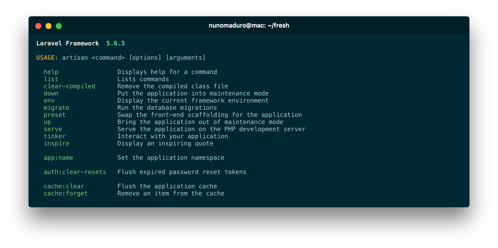

<p align="center">
    
</p>

<p align="center">
  <a href="https://github.com/nunomaduro/laravel-console-summary/actions/workflows/static.yml"></img></a>
  <a href="https://packagist.org/packages/nunomaduro/laravel-console-summary"></a>
  <a href="https://packagist.org/packages/nunomaduro/laravel-console-summary"></a>
</p>

## About Laravel Console Summary

Laravel Console Summary was created by, and is maintained by [Nuno Maduro](https://github.com/nunomaduro), and is a replacement for the List Command in Laravel Console Applications. Beautiful Laravel Console Summary for Artisan or Laravel Zero.

## Installation

> **Requires [PHP 8.1+](https://php.net/releases)**

Require Laravel Console Summary using [Composer](https://getcomposer.org):

```bash
composer require nunomaduro/laravel-console-summary
```

## Configuration

Publish the configuration

```bash
php artisan vendor:publish
```

You may want to clean up the summary screen by hiding some well-known commands from it. Of course, even hidden, they will still be available.

```php
// config/laravel-console-summary.php

return [
    'hide' => [
        'make:*',
        'list'
    ],
];
```

You can also override the binary name that is output in the usage information, by adding a `binary` key to your config.

```php
// config/laravel-console-summary.php

return [
    // ...
    
    'binary' => 'custom-name',
];
```

## Contributing

Thank you for considering to contribute to Laravel Console Summary. All the contribution guidelines are mentioned [here](CONTRIBUTING.md).

You can have a look at the [CHANGELOG](CHANGELOG.md) for constant updates & detailed information about the changes. You can also follow the Twitter account for latest announcements or just come say hi!: [@enunomaduro](https://twitter.com/enunomaduro)

## Support the development

**Do you like this project? Support it by donating**

- PayPal: [Donate](https://www.paypal.com/cgi-bin/webscr?cmd=_s-xclick&hosted_button_id=66BYDWAT92N6L)
- Patreon: [Donate](https://www.patreon.com/nunomaduro)

## License

Laravel Console Summary is an open-sourced software licensed under the [MIT license](LICENSE.md).
